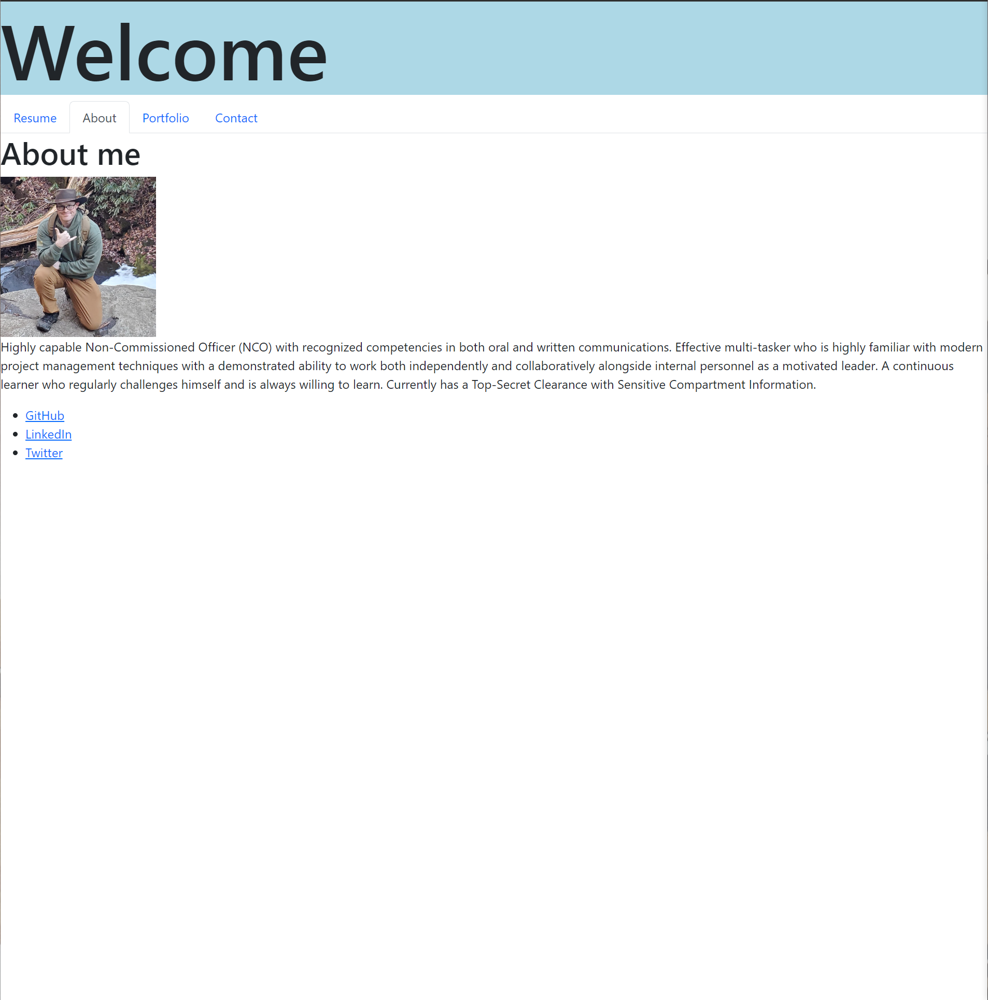

# Baacke-portfolio-2

## Description

- I wanted to test my limits of REACT coding. At the same time I wanted to have a live document that would show my progress as a programer.
- I  started with a simple wrieframe drawing to organize my thoughts. I then sectioned off the nessary elements to at least get the page some what presentable. 
- through this  I gained more on how to properly tie my various componants to eachother and the App.js. while it might not be the most DRY code to the task in regards to imports and const variables it is successful in acomplishing the task at hand. i look forward to going back and further experimenting with this page in the near future.
## Table of Contents 

- [Installation](#installation)
- [Usage](#usage)
- [Credits](#credits)
- [License](#license)

## Installation

[Baacke Portfolio](https://github.com/CrowTrooper202/Baacke-portfolio-2)

## Usage

the page uses links at the top pf the page for easy navigation.

## Credits

N/A

## License

N/A